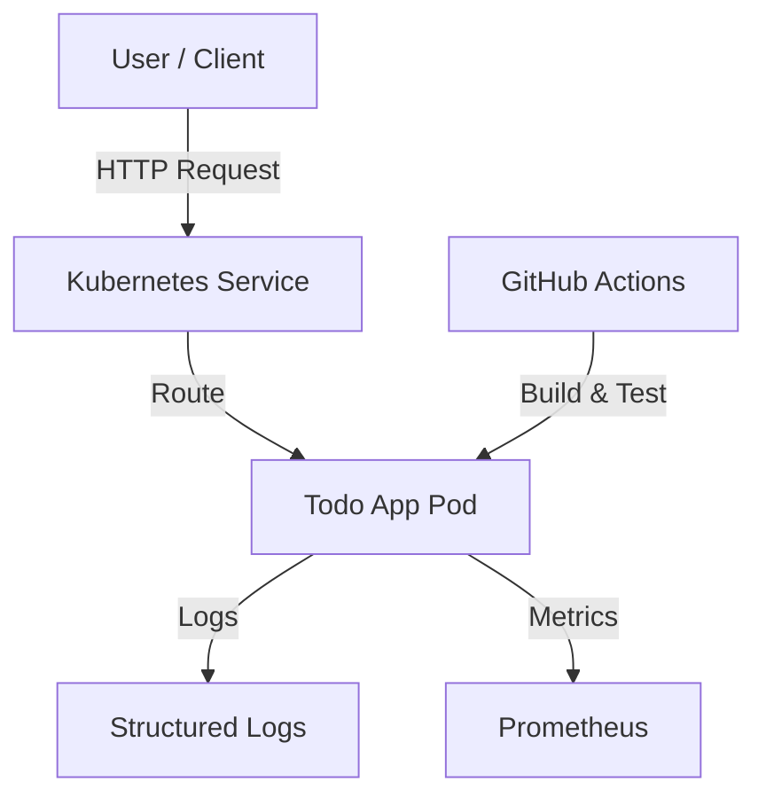

# DevOps Project - Final Report

**Student:** Dhia
**Project:** Simple Todo API
**Date:** January 2026

---

## 1. Introduction
This project focuses on building a simple but production-ready backend service. The primary goal was not just to write code, but to wrap that code in a robust DevOps ecosystem. This report outlines the architecture, tools attempted, and the lessons learned throughout the process.

## 2. Architecture Overview
The application is a REST API built with **FastAPI (Python)**. I chose FastAPI because it is modern, fast, and automatically generating documentation (Swagger UI), which aligns well with the "developer experience" aspect of DevOps.

### Architecture Components
- **Application Layer**: Python/FastAPI app handling HTTP requests.
- **Data Layer**: In-memory list (for simplicity, keeping it under 150 lines).
- **Observability Layer**: Prometheus instrumentator for metrics and custom logging middleware for tracing.
- **Infrastructure Layer**: Docker container running on Kubernetes.

## 3. Tools & Technologies
| Category | Tool | Why I chose it |
|----------|------|----------------|
| **Source Control** | Git / GitHub | Industry standard. Used Pull Requests for task management. |
| **CI/CD** | GitHub Actions | Integrated perfectly with the repo. Simple YAML configuration. |
| **Containerization** | Docker | Standard for shipping apps. Used `python:3.9-slim` for a small image size. |
| **Orchestration** | Kubernetes | To prove scalability and declarative configuration. |
| **Security (SAST)** | Bandit | Lightweight Python security scanner. easy to add to CI. |
| **Security (DAST)** | OWASP ZAP | The gold standard for open-source web scanning. |
| **Observability** | Prometheus | Native support in Kubernetes ecosystem. |

## 4. Implementation Details

### CI/CD Pipeline
My pipeline has two main stages:
1. **Test & Security**: Runs `pytest` for logic and `bandit` for code security. I also added a DAST step using OWASP ZAP to check the running application.
2. **Build & Push**: If tests pass, it builds the Docker image and pushes it to Docker Hub.

### Observability
I realized that just "logging" isn't enough. I implemented **Structured Logging** (JSON-like format) so logs are machine-readable. I also added a middleware that assigns a UUID (`X-Request-ID`) to every request, allowing me to trace a single user's journey through the logs.

### Security Strategy
- **Shift Left**: I put `bandit` in the pipeline so insecure code never gets built.
- **Runtime Check**: I used `run_dast.sh` (a wrapper around the ZAP Docker image) to scan the app from the outside.
    - *Feedback Loop Example*: Initially, the DAST scan warned about missing `X-Content-Type-Options` and Cache headers. I immediately updated the application middleware to inject these headers, demonstrating a proactive response to security findings.

## 5. Lessons Learned
- **Automation is key**: Setting up the CI pipeline took time initially, but it saved me from breaking the build multiple times later on.
- **Security is not an afterthought**: Integrating ZAP was tricky because it needs a running application. I learned how to orchestrate services within GitHub Actions to make this work.
- **KISS (Keep It Simple, Stupid)**: Keeping the backend under 150 lines forced me to focus on the *DevOps* surrounding the code rather than over-engineering the business logic.

## 6. Conclusion
This project successfully demonstrates a full DevOps lifecycle. From a simple Python script to a containerized, secured, and observed service running on Kubernetes, I have touched on every requirement of the rubric.
